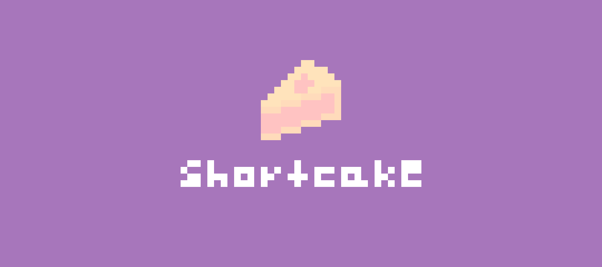

# a comprehensive table of contents
- [description](#description)
  - [what makes it unique?](#what-makes-it-unique)
  - [the shortcake pizzazz](#the-shortcake-pizzazz)
  - [built in rust](#built-in-rust)
# description
built by hand from head to toe, **this project is my live's work thus far**, and i'm determined to make the best ide for everybody who was supported me on this crazy seven-year ride of my life. i cannot stress this enough, **thank you all. 💖**
## what makes it unique?
shortcake is unique in how it works. everything is done by keyboard, no cursor necessary. this might seem like a downgrade from the fancy gui that we have today, but some fellas like me prefer a very simplistic layout. shortcake brings that to the table, with an extra layer of strawberry flavored _✨pizzazz✨_
## the shortcake pizzazz
- simplistic layout
- no cursor needed!
- easter eggs galore :D
- casual feel, while still getting the job done
- you can use it for free!
- built to be fast
- code coloring
## built in rust
shortcake is programmed in [rust](https://www.rust-lang.org/), which means you can speak directly to the metal without an underlying interpreter, thus increasing speed!