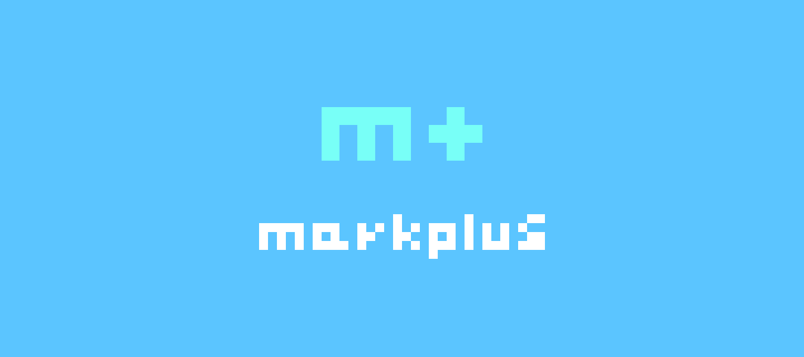

# a comprehensive table of contents
- [description](#description)
  - [what makes it unique?](#what-makes-it-unique)
  - [the shortcake pizzazz](#the-shortcake-pizzazz)
  - [built in rust](#built-in-rust)
- [about markplus](#about-markplus)
  - [why not just use markdown?](#why-not-just-use-markdown?)
  - [example usage](#example-usage)
# description
shortcake is more than just an ide. it's its own sorta operating system building off of the underlying os foundation. i designed it this way for three main reasons:
- i can't make my own operating system *(trust me, i've tried)*
- ease of access *(not having to install a whole new os)*
- fluidity *(easy to switch environments)*

built by hand from head to toe, **this project is my live's work thus far**, and i'm determined to make the best ide for everybody who was supported me on this crazy seven-year ride of my life. i cannot stress this enough, **thank you all. 💖**
## what makes it unique?
shortcake is unique in how it works. everything is done by keyboard, no cursor necessary. this might seem like a downgrade from the fancy gui that we have today, but some fellas like me prefer a very simplistic layout. shortcake brings that to the table, with an extra layer of strawberry flavored _✨pizzazz✨_
## the shortcake pizzazz
- simplistic layout
- no cursor needed!
- easter eggs galore :D
- casual feel, while still getting the job done
- you can use it for free!
- built to be fast
## built in rust
shortcake is programmed in [rust](https://www.rust-lang.org/), which means you can speak directly to the metal without an underlying interpreter, thus increasing speed!
# about markplus

_markplus_ is a brand new markup language that shares its release with shortcake! markplus is directly integrated into shortcake for ease of editing.
## why not just use markdown?
markdown is fine for some situations, but in many situations it's not adequate. it lacks many features, a few of these being:
- underlining
- colors
- video integration
- text align + justify

on top of this, [a markdown document may differ across interpreters.](https://en.wikipedia.org/wiki/Markdown#:~:text=The%20initial%20description%20of%20Markdown,%20diverge%20from%20the%20original%20version.) markplus includes underlining, video, text align, and _**30+**_ colors to get your message across better.
## native support
addressing the elephant in the room, markplus lacks support as of now. currently, html and markdown are the markup languages of choice for many and have been around for decades ([markdown turned 20 this year!](https://en.wikipedia.org/wiki/Markdown#:~:text=in%202004)). but hey, i just made it for fun, so my mission is already complete. it's up to you to use it or not :)
## example usage
```markplus
#header #red hello
#blue #small world!
#b #i hello again!
```